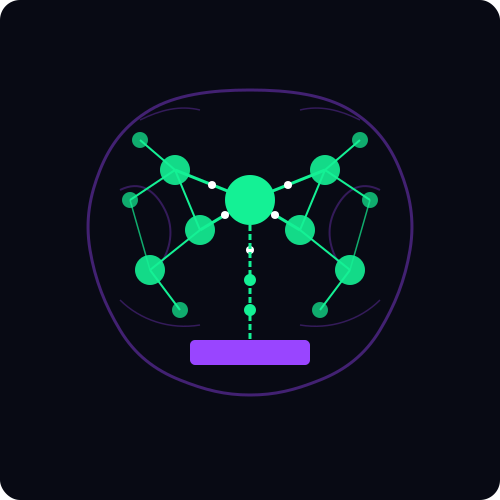
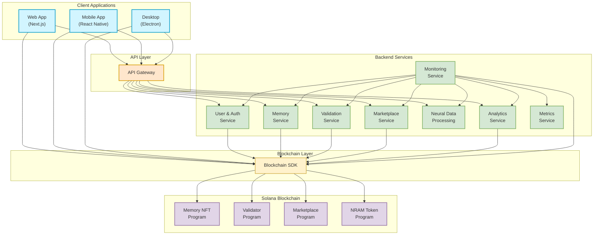
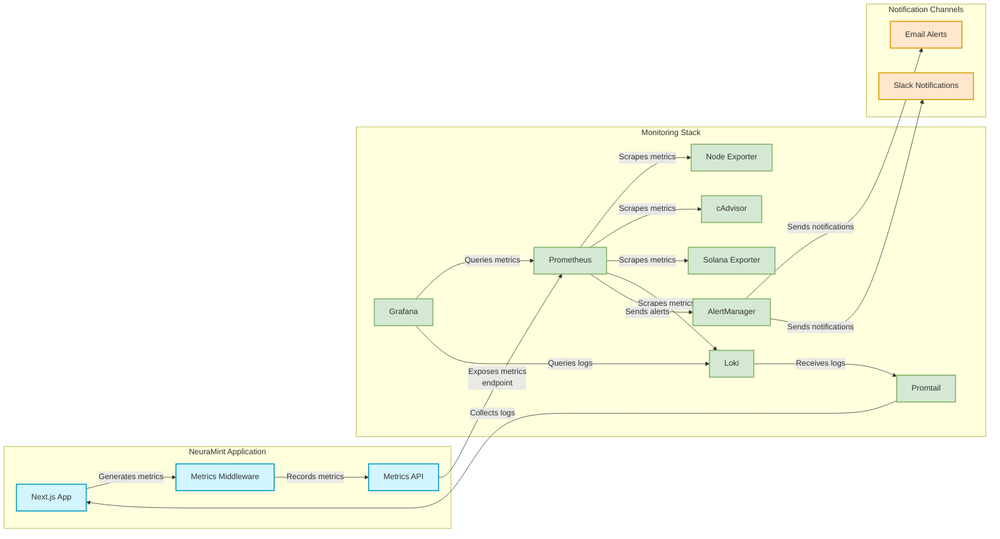

# NeuraMint

<div align="center">
  

  <h3>Transforming Neural Memories into Digital Assets on Solana</h3>

  <p>
    <a href="https://www.neuramint.tech" target="_blank"></a>
    <a href="https://x.com/NeuraMint_" target="_blank"></a>
    <a href="https://github.com/NeuraMint/NRAM" target="_blank"></a>
  </p>
</div>

## Overview

NeuraMint is a groundbreaking platform that leverages brain-computer interface (BCI) technology and Solana blockchain to transform neural data into unique, verifiable NFTs that can be traded on a decentralized marketplace.

Our platform creates an innovative ecosystem where users can:

- **Capture** neural patterns using BCI technology
- **Mint** these patterns as unique NFTs on Solana
- **Verify** the authenticity and value through a decentralized validation system
- **Trade** memory NFTs on a specialized marketplace

## Key Features

- **Neural Data Processing**: Advanced algorithms convert brain signals into digital assets
- **Memory NFT Minting**: Create unique tokens representing neural patterns
- **Decentralized Validation**: Community-driven verification system ensures authenticity
- **Memory Marketplace**: Buy, sell, and collect unique memory NFTs
- **Validator Dashboard**: Track validation performance, history, and rewards
- **Multi-tier Memory Classification**: Organize memories by type and quality
- **Analytics**: View market trends and memory performance metrics
- **Monitoring**: Comprehensive system monitoring for platform reliability

## Platform Architecture

NeuraMint follows a modular architecture that integrates frontend components with Solana blockchain smart contracts:



Additionally, here's how our monitoring stack integrates with the platform:



## Memory Types and Classification

NeuraMint supports six fundamental memory types, each with distinct characteristics and values:

1. **Visual**: Memories related to visual perception and imagery
2. **Conceptual**: Memories of abstract concepts and ideas
3. **Emotional**: Memories of feelings and emotional experiences 
4. **Procedural**: Memories related to skills and procedures
5. **Episodic**: Memories of specific events and experiences
6. **Spatial**: Memories related to spatial awareness and navigation

Each memory NFT is classified into quality tiers based on neural data complexity and rarity:

- **Common** (50%): Basic neural patterns with standard features
- **Fine** (30%): Complex neural patterns with distinctive attributes
- **Excellent** (15%): Highly sophisticated patterns with unique characteristics
- **Legendary** (5%): Exceptionally rare patterns with extraordinary complexity

## Technical Stack

NeuraMint is built using the following technologies:

### Frontend
- **Next.js**: React framework for building the user interface
- **TypeScript**: Type-safe language for better developer experience
- **Tailwind CSS**: Utility-first CSS framework for rapid UI development
- **Framer Motion**: Animation library for smooth UI transitions
- **Recharts**: Composable charting library for data visualization

### Blockchain Integration
- **Solana Web3.js**: SDK for interacting with Solana blockchain
- **Anchor Framework**: Framework for developing Solana programs
- **SPL Token Standard**: Solana token standard for NFTs
- **Wallet Adapter**: Solana wallet connection libraries

### Backend
- **Next.js API Routes**: Serverless API endpoints
- **Solana Programs**: Smart contracts for memory NFTs and validation
- **IPFS/Arweave**: Decentralized storage for memory metadata
- **TensorFlow.js**: Neural network libraries for BCI data processing

### Monitoring and Metrics
- **Prometheus**: Metrics collection and alerting
- **Grafana**: Data visualization and dashboards
- **Loki**: Log aggregation and exploration
- **AlertManager**: Alert handling and notification
- **Node Exporter**: Hardware and OS metrics collection
- **cAdvisor**: Container metrics collection
- **Solana Exporter**: Blockchain metrics collection

## Getting Started

### Prerequisites

- Node.js (v16+)
- NPM or Yarn
- Solana CLI tools (for blockchain development)
- A Solana wallet (Phantom, Solflare, etc.)
- Docker and Docker Compose (for monitoring stack)

### Installation

1. Clone the repository:
   ```bash
   git clone https://github.com/NeuraMint/NRAM.git
   cd NeuraMint
   ```

2. Install dependencies:
   ```bash
   npm install
   # or
   yarn install
   ```

3. Set up environment variables:
   ```bash
   cp .env.example .env.local
   ```
   Edit `.env.local` with your configuration settings.

4. Run the development server:
   ```bash
   npm run dev
   # or
   yarn dev
   ```

5. Open [http://localhost:3000](http://localhost:3000) in your browser.

### Setting Up Monitoring

1. Navigate to the monitoring directory:
   ```bash
   cd monitoring
   ```

2. Start the monitoring stack:
   ```bash
   docker-compose up -d
   ```

3. Access Grafana at [http://localhost:3000](http://localhost:3000) with default credentials (admin/neuramint_admin).

## Project Structure

```
NeuraMint/
├── app/                    # Next.js application
│   ├── components/         # Reusable UI components
│   │   ├── analytics/      # Analytics components
│   │   ├── common/         # Common UI components
│   │   ├── layout/         # Layout components
│   │   ├── marketplace/    # Marketplace components
│   │   └── social/         # Social features components
│   ├── config/             # Configuration files
│   ├── hooks/              # Custom React hooks
│   ├── middleware/         # Next.js middleware
│   ├── pages/              # Application pages and API routes
│   │   ├── api/            # API endpoints
│   │   │   ├── analytics/  # Analytics API endpoints
│   │   │   ├── market/     # Market API endpoints
│   │   │   └── memories/   # Memories API endpoints
│   │   └── memory/         # Memory detail pages
│   ├── public/             # Static assets
│   ├── services/           # API services
│   ├── types/              # TypeScript type definitions
│   └── utils/              # Utility functions
├── contracts/              # Solana smart contracts
│   └── tests/              # Contract tests
├── docs/                   # Documentation
│   ├── api/                # API documentation
│   ├── architecture/       # Architecture documentation
│   ├── blockchain/         # Blockchain integration docs
│   ├── deployment/         # Deployment guides
│   ├── development/        # Development guidelines
│   ├── security/           # Security documentation
│   └── user/               # User guides
├── monitoring/             # Monitoring infrastructure
│   ├── alertmanager/       # AlertManager configuration
│   ├── grafana/            # Grafana dashboards and config
│   ├── loki/               # Loki configuration
│   ├── prometheus/         # Prometheus configuration
│   │   └── rules/          # Alert rules
│   ├── promtail/           # Promtail configuration
│   └── solana-exporter/    # Solana metrics exporter
├── .env.example            # Example environment variables
├── package.json            # Project dependencies
└── README.md               # Project documentation
```

## Documentation

Comprehensive documentation is available in the `docs/` directory:

- [User Guide](docs/user/USER_GUIDE.md): Complete guide for using the platform
- [API Reference](docs/api/API.md): API endpoints and usage
- [Architecture Overview](docs/architecture/TECHNICAL_ARCHITECTURE.md): System design details
- [Blockchain Integration](docs/blockchain/INTEGRATION.md): Solana integration details
- [Smart Contracts](docs/blockchain/SMART_CONTRACTS.md): Smart contract documentation
- [Features](docs/user/FEATURES.md): Detailed platform features
- [Development Roadmap](docs/development/ROADMAP.md): Future development plans
- [Security Policies](docs/security/SECURITY.md): Security considerations and practices
- [Deployment Guide](docs/deployment/DEPLOYMENT.md): Deployment instructions

## Monitoring System

NeuraMint includes a comprehensive monitoring stack for tracking system performance:

- **Real-time Metrics**: Track API performance, memory operations, and blockchain interactions
- **Custom Dashboards**: Visualize platform activity and performance metrics
- **Automated Alerts**: Receive notifications for critical system events
- **Log Aggregation**: Centralized logging for troubleshooting
- **Blockchain Monitoring**: Track Solana network performance and contract interactions

## Contributing

We welcome contributions from the community! Please follow these steps:

1. Fork the repository
2. Create a feature branch: `git checkout -b feature/your-feature-name`
3. Commit your changes: `git commit -m 'Add some feature'`
4. Push to the branch: `git push origin feature/your-feature-name`
5. Open a pull request

Please read our [Contributing Guidelines](docs/development/CONTRIBUTING.md) for more details.

## License

This project is licensed under the MIT License - see the [LICENSE](LICENSE) file for details.

## Contact

- Website: [www.neuramint.tech](https://www.neuramint.tech)
- Twitter: [@NeuraMint_](https://x.com/NeuraMint_)
- GitHub: [NeuraMint/NRAM](https://github.com/NeuraMint/NRAM)

## Acknowledgements

- The Solana community for providing tools and support
- BCI device manufacturers for advancing neural interface technology
- All contributors who have helped build the NeuraMint platform 