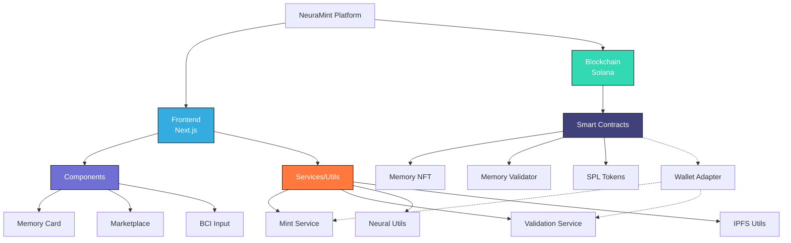
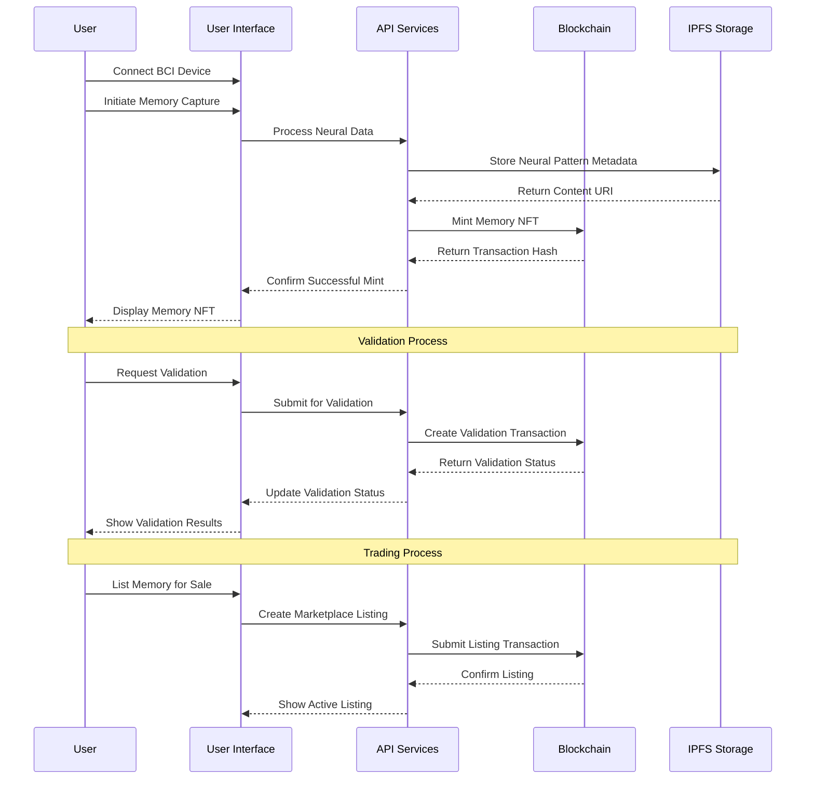
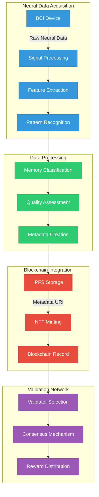
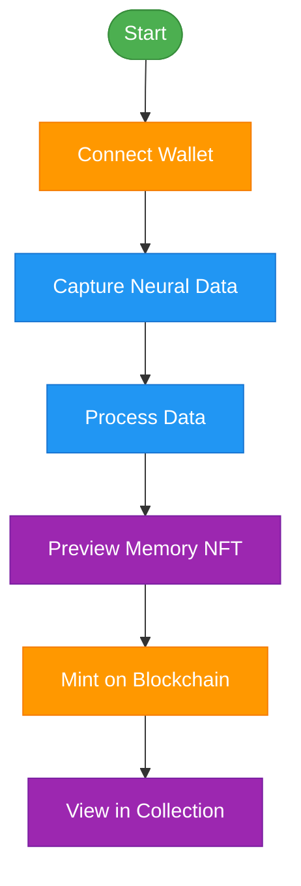
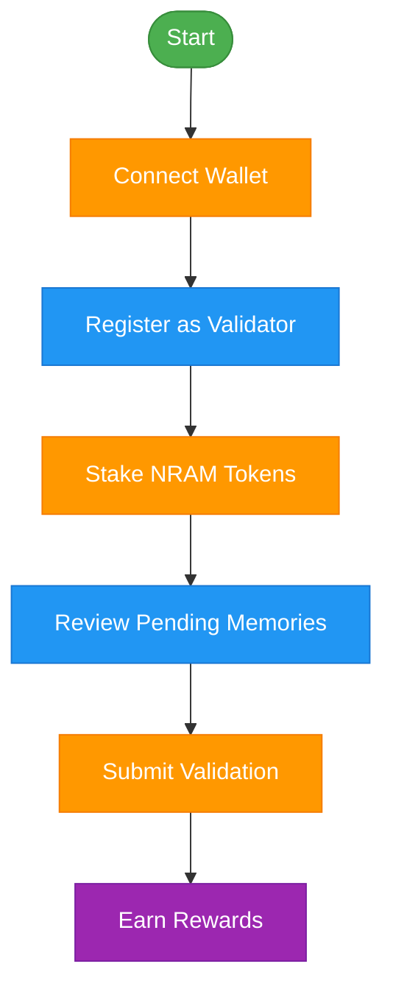
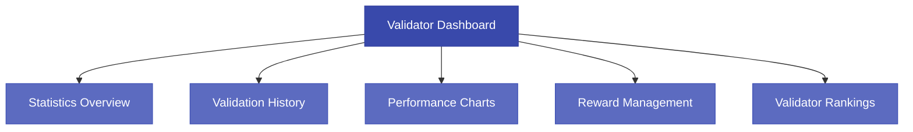
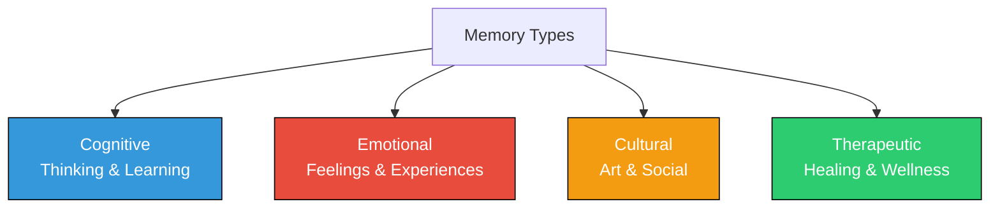
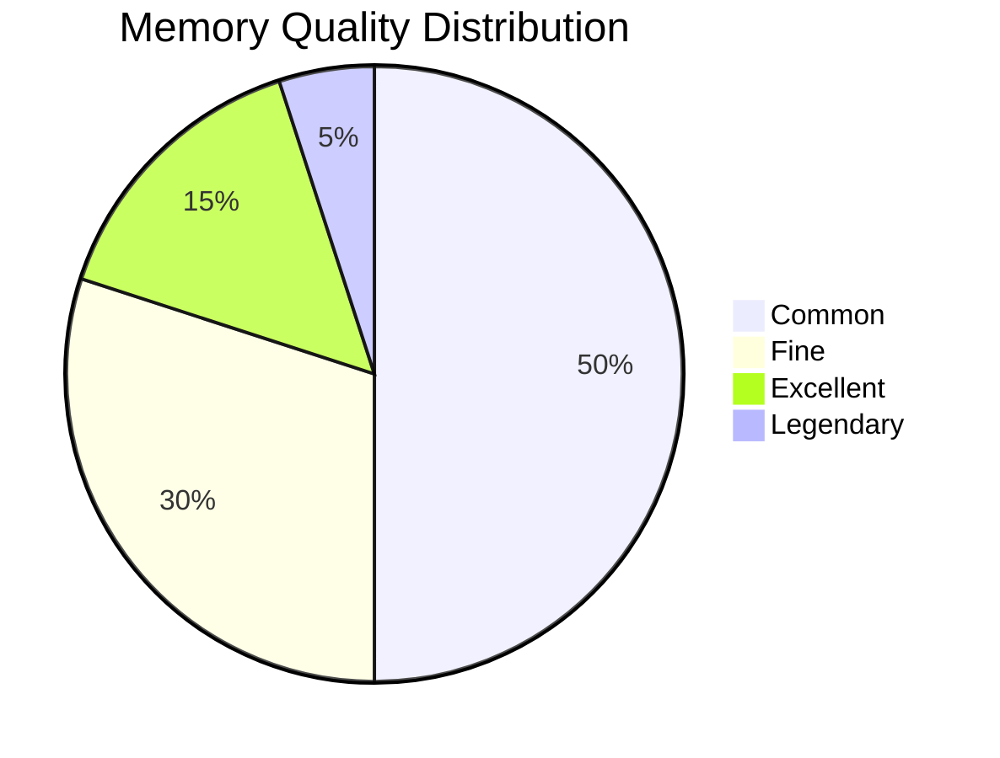
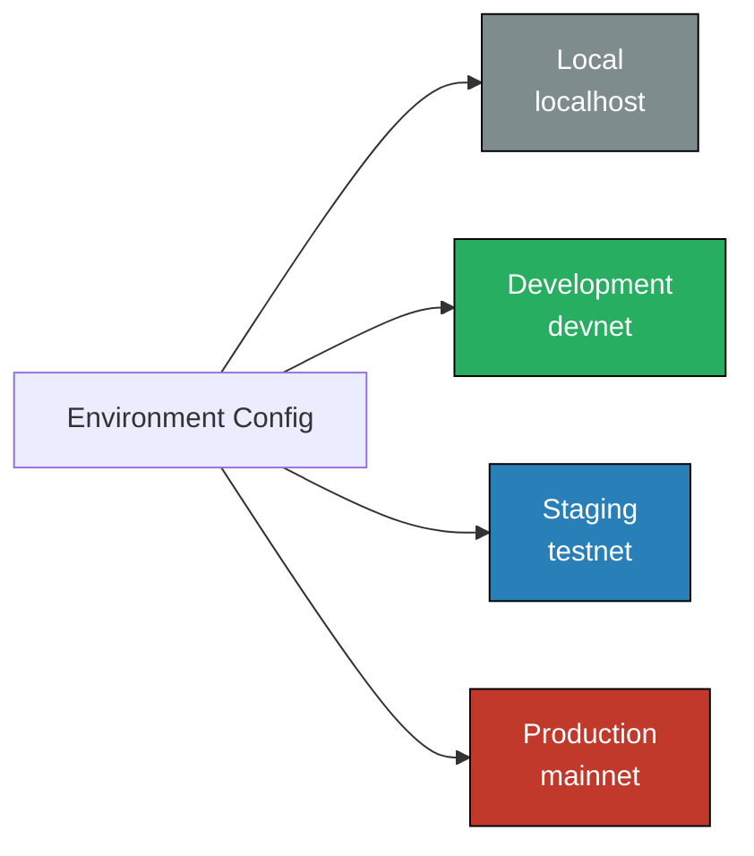

# NeuraMint

<div align="center">
  

  <h3>Transforming Memories into Digital Assets on Solana</h3>

  <p>
    <a href="https://www.neuramint.tech" target="_blank"></a>
    <a href="https://x.com/NeuraMint_" target="_blank"></a>
    <a href="https://github.com/NeuraMint/NRAM" target="_blank"></a>
  </p>
</div>

## Overview

NeuraMint is a groundbreaking platform that leverages brain-computer interface (BCI) technology and Solana blockchain to transform neural data into unique, verifiable NFTs that can be traded on a decentralized marketplace.

NeuraMint creates an innovative ecosystem where users can:

- **Capture** neural patterns using BCI technology
- **Mint** these patterns as unique NFTs on Solana
- **Verify** the authenticity and value through a decentralized validation system
- **Trade** memory NFTs on a specialized marketplace

## Key Features

- **Neural Data Processing**: Advanced algorithms convert brain signals into digital assets
- **Memory NFT Minting**: Create unique tokens representing neural patterns
- **Decentralized Validation**: Community-driven verification system ensures authenticity
- **Memory Marketplace**: Buy, sell, and collect unique memory NFTs
- **Validator Dashboard**: Track validation performance, history, and rewards
- **Multi-tier Memory Classification**: Organize memories by type and quality

## Platform Architecture

NeuraMint follows a modular architecture that integrates frontend components with Solana blockchain smart contracts:

### System Overview



### Data Flow

The NeuraMint platform operates with the following data flow:

```mermaid
flowchart LR
    classDef deviceClass fill:#16a085,stroke:#000,stroke-width:1px,color:white
    classDef processClass fill:#2980b9,stroke:#000,stroke-width:1px,color:white
    classDef storageClass fill:#8e44ad,stroke:#000,stroke-width:1px,color:white
    classDef blockchainClass fill:#c0392b,stroke:#000,stroke-width:1px,color:white
    classDef marketClass fill:#d35400,stroke:#000,stroke-width:1px,color:white
    
    BCIDevice[BCI Device]:::deviceClass
    NeuralAnalysis[Neural Analysis]:::processClass
    IPFSStorage[IPFS Storage]:::storageClass
    MemoryNFT[Memory NFT]:::blockchainClass
    Marketplace[Marketplace]:::marketClass
    Validation[Validation Network]:::processClass
    NeuralFingerprinting[Neural Fingerprinting]:::processClass
    MetadataRetrieval[Metadata Retrieval]:::storageClass
    
    %% Main flow
    BCIDevice --> NeuralAnalysis
    NeuralAnalysis --> IPFSStorage
    IPFSStorage --> MemoryNFT
    MemoryNFT --> Marketplace
    
    %% Secondary flows
    Marketplace --> Validation
    Validation --> MetadataRetrieval
    MetadataRetrieval --> Validation
    
    %% Neural fingerprinting
    BCIDevice --> NeuralFingerprinting
    NeuralFingerprinting --> IPFSStorage
```



### Technical Implementation



## Technical Stack

NeuraMint is built using the following technologies:

### Frontend
- **Next.js**: React framework for building the user interface
- **TypeScript**: Type-safe language for better developer experience
- **Tailwind CSS**: Utility-first CSS framework for rapid UI development
- **Framer Motion**: Animation library for smooth UI transitions
- **Recharts**: Composable charting library for data visualization

### Blockchain Integration
- **Solana Web3.js**: SDK for interacting with Solana blockchain
- **Anchor Framework**: Framework for developing Solana programs
- **SPL Token Standard**: Solana token standard for NFTs
- **Wallet Adapter**: Solana wallet connection libraries

### Backend
- **Solana Programs**:
  - **Memory NFT**: Smart contract for minting and managing memory NFTs
  - **Memory Validator**: Smart contract for validating memory authenticity
- **IPFS/Arweave**: Decentralized storage for memory metadata and images

## Memory Processing and Storage



## User Workflows

### Memory Creation Workflow



### Validation Workflow



## Validator Dashboard

The validator dashboard provides comprehensive tools for validators to monitor and manage their validation activities:

### Key Features

- **Statistics Overview**: View total validations, success rate, and rewards
- **Validation History**: Browse complete history of validation activities
- **Performance Charts**: Visual representation of validation trends over time
- **Reward Tracking**: Monitor earned and pending rewards
- **Validator Rankings**: See how you compare to other validators

### Dashboard Components



## Memory Types and Classification

NeuraMint supports four fundamental memory types, each with distinct characteristics and values:



Each memory NFT is classified into quality tiers based on neural data complexity and rarity:



## Internationalization

NeuraMint is designed with internationalization in mind:

- **Multi-language Support**: Core platform components ready for localization
- **Language Detection**: Automatic language detection based on user preferences
- **Internationalized UI**: All user interface elements prepared for translation
- **Documentation**: Available in multiple languages

## Core Features

### 1. Neural Data Processing

The platform uses sophisticated algorithms to process raw neural data into meaningful memory patterns:

```typescript
// Sample from neuralUtils.ts
export const analyzeNeuralData = async (data: ArrayBuffer): Promise<NeuralAnalysisResult> => {
  // Simulate processing delay
  await new Promise(resolve => setTimeout(resolve, 2000));
  
  // Create neural fingerprint from data
  const hashBuffer = await crypto.subtle.digest('SHA-256', data);
  const hashArray = Array.from(new Uint8Array(hashBuffer));
  const neuralFingerprint = '0x' + hashArray.map(b => b.toString(16).padStart(2, '0')).join('');
  
  // Determine memory quality based on neural complexity
  const qualityDeterminator = hashArray[0] % 100;
  let quality: MemoryQuality;
  
  if (qualityDeterminator < 50) {
    quality = 'common';
  } else if (qualityDeterminator < 80) {
    quality = 'fine';
  } else if (qualityDeterminator < 95) {
    quality = 'excellent';
  } else {
    quality = 'legendary';
  }
  
  // Determine other attributes
  // ... [additional processing]
  
  return {
    quality,
    type,
    brainRegion,
    emotionalValence,
    cognitiveLoad,
    neuralFingerprint,
    confidenceScore,
    timestamp: Date.now()
  };
};
```

### 2. Memory NFT Minting

Users can mint their neural patterns as NFTs on Solana:

```typescript
// Sample from mintService.ts
async mintMemoryNFT(metadata: MemoryMetadata): Promise<{ signature: string; mintKey: PublicKey; memoryKey: PublicKey }> {
  try {
    // Generate new mint keypair
    const mintKeypair = Keypair.generate();
    const mintKey = mintKeypair.publicKey;
    
    // Derive memory PDA
    const [memoryPda, memoryBump] = await PublicKey.findProgramAddress(
      [Buffer.from("memory"), mintKey.toBuffer()],
      this.program.programId
    );
    
    // Build and send transaction
    const transaction = new Transaction();
    
    // Add instructions for creating mint account, token account, and minting NFT
    // ... [transaction setup]
    
    // Sign and confirm transaction
    const signature = await sendAndConfirmTransaction(
      this.connection,
      transaction,
      [this.wallet.payer, mintKeypair]
    );
    
    return {
      signature,
      mintKey,
      memoryKey: memoryPda
    };
  } catch (error) {
    throw new Error(`Memory NFT minting failed: ${error.message}`);
  }
}
```

### 3. Decentralized Validation

The platform includes a validation network for verifying memory authenticity:

```typescript
// Sample from validationService.ts
async submitValidation(request: ValidationRequest): Promise<string> {
  try {
    // Create unique validation ID
    const validationId = Keypair.generate().publicKey.toString();
    
    // Derive validation PDA
    const [validationPda, validationBump] = await PublicKey.findProgramAddress(
      [Buffer.from("validation"), new PublicKey(validationId).toBuffer()],
      this.program.programId
    );
    
    // Build and submit validation transaction
    const tx = await this.program.methods
      .submitValidation({
        memoryId: request.memoryId,
        neuralFingerprint: request.neuralFingerprint,
        quality: request.quality,
        description: request.description,
        timestamp: new BN(Math.floor(Date.now() / 1000)),
      })
      .accounts({
        validation: validationPda,
        validator: validatorPda,
        authority: this.wallet.publicKey,
        systemProgram: SystemProgram.programId,
      })
      .rpc();
    
    return validationId;
  } catch (error) {
    throw new Error(`Validation submission failed: ${error.message}`);
  }
}
```

### 4. Memory Marketplace

The marketplace allows users to browse, buy, and sell memory NFTs:

```typescript
// Sample market filtering functionality from marketplace.tsx
useEffect(() => {
  let result = [...memories];
  
  // Apply search query
  if (searchQuery) {
    const query = searchQuery.toLowerCase();
    result = result.filter(
      memory => memory.name.toLowerCase().includes(query) || 
               memory.neuralFingerprint.toLowerCase().includes(query)
    );
  }
  
  // Apply type filters
  if (filterOptions.types.length > 0) {
    result = result.filter(memory => filterOptions.types.includes(memory.memoryType));
  }
  
  // Apply quality filters
  if (filterOptions.qualities.length > 0) {
    result = result.filter(memory => filterOptions.qualities.includes(memory.quality));
  }
  
  // Apply price range filters
  result = result.filter(
    memory => memory.price >= filterOptions.minPrice && memory.price <= filterOptions.maxPrice
  );
  
  // Apply brain region filters
  if (filterOptions.brainRegions.length > 0) {
    result = result.filter(memory => filterOptions.brainRegions.includes(memory.brainRegion));
  }
  
  setFilteredMemories(result);
}, [memories, filterOptions, searchQuery]);
```

## Project Directory Structure

```
NeuraMint/
├── app/                  # Frontend application
│   ├── components/       # React components
│   ├── pages/            # Page components and routing
│   ├── public/           # Static resources
│   ├── services/         # Service classes
│   ├── utils/            # Utility functions and hooks
│   └── styles/           # Global styles and themes
├── contracts/            # Solana smart contracts
│   ├── programs/         # Anchor program source code
│   │   ├── memory_nft/   # Memory NFT program
│   │   └── memory_validator/ # Validator program
│   └── tests/            # Smart contract tests
├── docs/                 # Project documentation
└── README.md             # Project overview
```

## Getting Started

### Frontend Application

```bash
# Navigate to app directory
cd app

# Install dependencies
npm install

# Run development server
npm run dev

# Build production version
npm run build
```

### Solana Smart Contracts

```bash
# Navigate to contracts directory
cd contracts

# Install dependencies
npm install

# Build programs
anchor build

# Deploy to Solana devnet
anchor deploy --provider.cluster devnet

# Run tests
anchor test
```

## Environment Configuration

NeuraMint uses environment-specific configuration for different deployment stages:



## Project Roadmap

NeuraMint is under active development with the following roadmap:

### Q2 2023 (Completed)
- ✅ Core platform architecture
- ✅ Basic memory NFT minting
- ✅ Validation system prototyping
- ✅ UI/UX foundation

### Q3-Q4 2023 (Completed)
- ✅ Enhanced validation system
- ✅ Memory marketplace
- ✅ Validator dashboard with statistics
- ✅ Integration with multiple wallet providers

### Q1-Q2 2024 (In Progress)
- 🔄 Advanced neural data analysis
- 🔄 Expanded validator rewards system
- 🔄 Memory collections and galleries
- 🔄 Mobile application development

### Q3-Q4 2024 (Planned)
- ⏳ Customizable memory visualization
- ⏳ Enhanced BCI device support
- ⏳ DAO governance implementation
- ⏳ Cross-chain compatibility exploration

## Contributing

Contributions to NeuraMint are welcome! Please follow these steps:

1. Fork the repository
2. Create a feature branch (`git checkout -b feature/amazing-feature`)
3. Commit your changes (`git commit -m 'Add some amazing feature'`)
4. Push to the branch (`git push origin feature/amazing-feature`)
5. Open a Pull Request

## License

This project is licensed under the MIT License - see the [LICENSE](LICENSE) file for details.

## Contact

- Project Website: [neuramint.tech](https://www.neuramint.tech)
- Twitter: [@NeuraMint_](https://x.com/NeuraMint_)
- GitHub: [NeuraMint/NRAM](https://github.com/NeuraMint/NRAM)

---

*NeuraMint - The Future of Memory, Now.* 